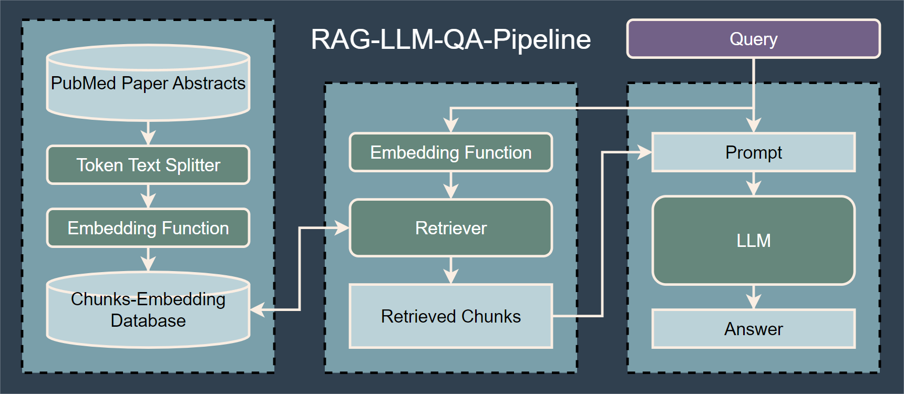

# RAG-LLM-Bio-QA-System
## By Saturday Night Live, Pretraining 

### A RAG-enhanced, LLM-based System for Biomedical Question Answering

Disclaimer: This project is created as part of the requirement for the COMP0087 module at the Department of Computer Science, University College London (UCL).

## Project Outline

### Datasets utilized in project:
1. BioASQ: http://bioasq.org/
2. QALM (Huggingface): https://huggingface.co/datasets/asus-aics/QALM

### Databases utilized in project:
1. Golden References from BioASQ
2. MedRAG/pubmed:　https://huggingface.co/datasets/MedRAG/pubmed

### LLMs utilized in project:
1. OpenAI-ChatGPT-3.5-turbo API
2. Llama-2-7b-chat-GGUF: https://huggingface.co/TheBloke/Llama-2-7B-Chat-GGUF
3. Llama-2-13b-chat-GGUF: https://huggingface.co/TheBloke/Llama-2-13B-chat-GGUF

### Embedding functions utilized in project: 
1. OpenAI text-embedding-ada-002 API
2. E5-large-unsupervised: https://huggingface.co/intfloat/e5-large-unsupervised

## Usage
To use the system, please follow these steps:
1. Install the required dependencies: `pip install -r requirements.txt`.
2. Download a text corpus (e.g. MedRAG/pubmed) to directory `refs`.
3. Configure and run `python RAG.py` to construct and save the FAISS database.
3. Download a dataset for system evaluation to directory `dataset` or configure `main.py` to single query answering.
4. Configure an LLM model in `main.py` with questions.
5. Run `python main.py` to evaluate the system's performance.

Further indication on code files:
1. `LLM.py`: Defines the two LLM model class and interface. 
2. `Datasets.py`: Defines the class `Question` as a general interface of question contents and classes `BioASQ` and `QALM_mcq` for the two defined datasets. Further datasets could be included by following the interface of `Question`.
3. `/scripts`: Some scripting files used for either testing or data gathering purposes. 

## Acknowledgements

We would like to thank all contributors for their valuable contributions to this project.

## Contact

For questions or inquiries, please contact yufei.gu.20@ucl.ac.uk (yufei.gu.job@gmail.com).